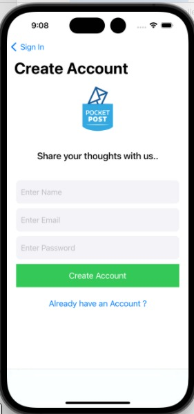
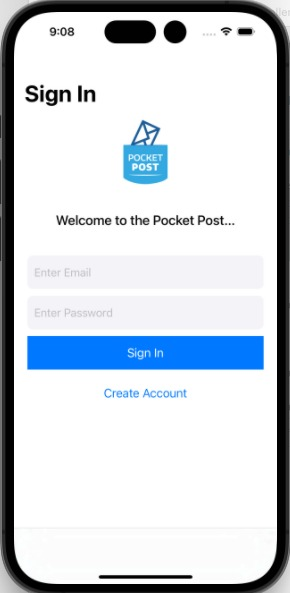
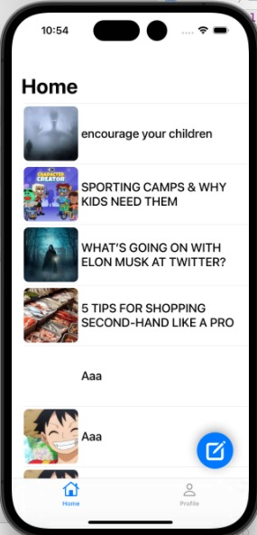
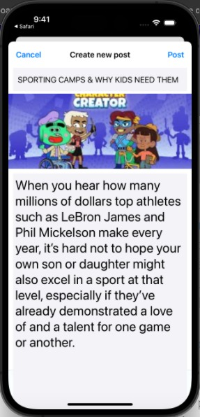
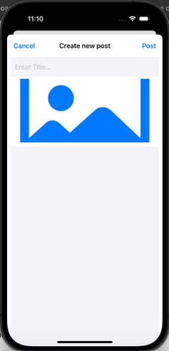
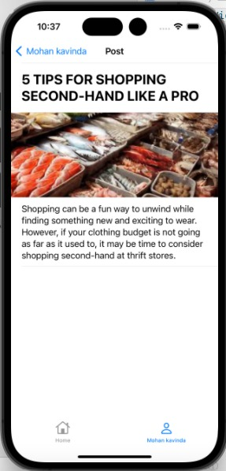

# Project Name - Pocket Post

#### 01. Brief Description of Project - 
Pocket Post is an iOS Swift mobile application designed for writers seeking to enhance their skills and engage with a community of fellow writers. With its intuitive interface and feature-rich functionality built on UIKit, Pocket Post aims to become the go-to tool for writers seeking to express themselves creatively and enhance their writing abilities as well as users to craft, share, and store their written works such as thoughts, stories, new ideas and many more, fostering creativity, collaboration, and personal growth.
#### 02. Users of the System - 
Pocket Post is tailored for writers of all levels, from aspiring authors to seasoned professionals, who are passionate about writing and eager to enhance their skills. Whether users write for personal enjoyment, professional development, or creative expression, Pocket Post provides a versatile platform to support their writing endeavors.
#### 03. What is unique about solution -
Pocket Post's unique blend of writing-focused features, user-friendly design, and emphasis on writing improvement sets it apart as a valuable tool for writers seeking to elevate their craft and achieve their writing goals.
#### 04. Functionality of the screens 
1. The first screen is used to sign up the Pocket Post application by using email and password.

 

2. The second screen is used to user sign in and then user can log into the application.

 

3. The third screen is home view of the application, user can see the collection of posts in the home page and also there is a button to write post.

 

4. The forth screen for user profile where user can see their own collection of posts and there is also functionality to change the profile picture.

 

5. The fifth screen for creating new posts for user.

 
 

5. The sixth screen is page view of posts

 

#### 05. UI Components used

The following components were used in the Landmark Identify App,
- UIButton
- UIAlert
- UIViewController
- UINavigationController
- UITableViewCell
- UiImageeView
- UILabel
- UIImage
- UIView
- UITextField
- UIImagePickerController
- UIBarButtonItem
- UITableView

  

