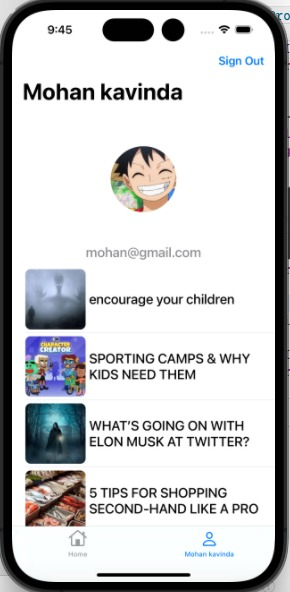

Please go under edit and edit this file as needed for your project.  There is no seperate documentation needed.

# Project Name - Pocket Post
# Student Id - IT20643522
# Student Name - Weerasinghe M.K.

#### 01. Brief Description of Project - 
Pocket Post is an iOS Swift mobile application designed for writers seeking to enhance their skills and engage with a community of fellow writers. With its intuitive interface and feature-rich functionality built on UIKit, Pocket Post aims to become the go-to tool for writers seeking to express themselves creatively and enhance their writing abilities as well as users to craft, share, and store their written works such as thoughts, stories, new ideas and many more, fostering creativity, collaboration, and personal growth.
#### 02. Users of the System - 
Pocket Post is tailored for writers of all levels, from aspiring authors to seasoned professionals, who are passionate about writing and eager to enhance their skills. Whether users write for personal enjoyment, professional development, or creative expression, Pocket Post provides a versatile platform to support their writing endeavors.
#### 03. What is unique about your solution -
Pocket Post's unique blend of writing-focused features, user-friendly design, and emphasis on writing improvement sets it apart as a valuable tool for writers seeking to elevate their craft and achieve their writing goals.
#### 04. Briefly document the functionality of the screens you have (Include screenshots of images)
1. The first screen is used to sign up the Pocket Post application by using email and password.

 

2. The second screen is used to user sign in and then user can log into the application.

 

3. The third screen is home view of the application, user can see the collection of posts in the home page and also there is a button to write post.

 

4. The forth screen for user profile where user can see their own collection of posts and there is also functionality to change the profile picture.

 

5. The fifth screen for creating new posts for user.

 
 

5. The sixth screen is page view of posts

 

 

#### 05. Give examples of best practices used when writing code
e.g The code below uses consistant naming conventions for variables, uses structures and constants where ever possible. (Elaborate a bit more on what you did)

```
  struct User {
    let firstName: String
    let lastName: String
    let age: Int
    let email: String?
    
   private let titleField: UITextField = {
    let field = UITextField()
    field.leftView = UIView(frame: CGRect(x: 0, y: 0, width: 10, height: 50))
    field.leftViewMode = .always
    field.placeholder = "Enter Title..."
    field.autocapitalizationType = .words
    field.autocorrectionType = .yes
    field.backgroundColor = .secondarySystemBackground
    field.layer.masksToBounds = true
    return field
}()

override func viewDidLayoutSubviews() {
    super.viewDidLayoutSubviews()
    titleField.frame = CGRect(x: 10, y: view.safeAreaInsets.top, width: view.width-20, height: 50)
    headerImageView.frame = CGRect(x: 0, y: titleField.bottom+5, width: view.width, height: 160)
    textView.frame = CGRect(x: 10, y: headerImageView.bottom+10, width: view.width-20, height: view.height-210-view.safeAreaInsets.top)
}

    
extension CreateNewPostViewController: UIImagePickerControllerDelegate, UINavigationControllerDelegate {
    func imagePickerControllerDidCancel(_ picker: UIImagePickerController) {
        picker.dismiss(animated: true, completion: nil)
    }
    ...
}

StorageManager.shared.uploadBlogHeaderImage(
    email: email,
    image: headerImage,
    postId: newPostId
) { success in
    ...
}

guard let title = titleField.text,
      !title.trimmingCharacters(in: .whitespaces).isEmpty,
      ...
else {
    let alert = UIAlertController(title: "Enter Post Details",
                                  message: "Please enter a title, body, and select a image to continue.",
                                  preferredStyle: .alert)
    alert.addAction(UIAlertAction(title: "Dismiss", style: .cancel, handler: nil))
    present(alert, animated: true)
    return
}

```

#### 06. UI Components used

The following components were used in the Landmark Identify App,
- UIButton
- UIAlert
- UIViewController
- UINavigationController
- UITableViewCell
- UiImageeView
- UILabel
- UIImage
- UIView
- UITextField
- UIImagePickerController
- UIBarButtonItem
- UITableView

#### 07. Testing carried out

e.g. The following classes implemented unit testing for the ```Landmark struct``` and ```Location struct```. 

```
    func test_UIConfiguration() {
    // Setup
    let sut = CreateNewPostViewController()
    
    // Load view hierarchy
    sut.loadViewIfNeeded()
    
    // Verify UI elements
    XCTAssertNotNil(sut.titleField, "Title field should be configured.")
    XCTAssertNotNil(sut.headerImageView, "Header image view should be configured.")
    XCTAssertNotNil(sut.textView, "Text view should be configured.")
}


func test_imagePickerIsPresented_whenHeaderTapped() {
    // Setup
    let sut = CreateNewPostViewController()
    sut.loadViewIfNeeded()
    
    // Assume this taps the header image view
    sut.didTapHeader()
    
    // Verify
    XCTAssertTrue(sut.presentedViewController is UIImagePickerController, "Image picker should be presented when header is tapped.")
}

func test_postCreationFails_whenTitleOrBodyIsEmpty() {
    // Setup
    let sut = CreateNewPostViewController()
    sut.loadViewIfNeeded()
    
    // Execute
    sut.titleField.text = ""
    sut.textView.text = "Sample body"
    sut.didTapPost()
    
    // Expect an alert for empty title
    let alert = sut.presentedViewController as? UIAlertController
    XCTAssertNotNil(alert, "An alert should be presented for missing title.")
    XCTAssertEqual(alert?.title, "Enter Post Details")
}

```

#### 08. Documentation 

(a) Design Choices
1. User Interface (UI):

* I opted for a clean and straightforward design, using UIViewController and UINavigationController to manage the presentation of different screens in a hierarchical manner. This choice likely aims to create an intuitive flow from authentication to profile management and post-creation.

* The UIButton, UITextField, and UILabel components suggest a focus on familiar user interaction elements, which are easily recognizable for users, fostering a user-friendly experience.

* The UITableViewCell combined with UITableView indicates that you've implemented a list-based layout for the posts, which is a commonly understood pattern for content feeds.

2. User Experience (UX):

* The use of UIAlert shows attention to informing users of actions or errors effectively, which is critical for smooth user interactions.

* Integration of UIImagePickerController suggests a choice to enhance posts with visual elements, which can significantly boost user engagement with the content.

3. Branding and Visual Design:

* The application logo and consistent use of color schemes in UI elements like buttons are key to creating a strong brand identity for Pocket Post.

(b) Implementation Decisions
Users can authenticate, write posts, examine their profiles, and read other users' postings with this iPhone client app. The code is largely written in MVC but also uses MVVM architecture. Backend functionality is provided by Firebase libraries.

1. Backend Services:

* I've implemented Firebase Authentication and Firebase Database which are robust choices for managing user accounts and data storage, respectively. This could allow for easy scalability and secure data handling.

* Decoupling the backend services from the frontend UI might have been a strategic decision to focus on a modular architecture.

2. Custom Components and Extensions:

* Utilizing custom subclasses of UIView, UIButton, and others might have been necessary to tailor the look and functionality to the app's specific needs.

* The UIBarButtonItem suggests customization of the navigation bar, possibly to integrate additional navigation or action items.

3. Image Management:

* UIImage and UIImageView components indicate a decision to manage image display and manipulation within the app, which could be crucial for allowing users to personalize their posts.

(c) Challenges

1. User Authentication:

Implementing a secure and user-friendly sign-in/sign-up process can be complex. Ensuring data privacy and security, especially when using third-party services like Firebase, requires careful handling and testing.

2. Data Handling:

Managing real-time updates, data synchronization, and offline capabilities with Firebase can present challenges, especially when scaling the user base and handling a large amount of user-generated content.

3. UI Consistency Across Devices:

Ensuring a consistent and responsive UI across different iPhone models and managing layout constraints can be difficult, particularly when dealing with dynamic content sizes.

4. Image Uploads and Handling:

Implementing a smooth and efficient image picker, handling various image formats, and optimizing uploads/downloads for performance and data usage can be complex tasks.

#### 09. Reflection

Challenges that you faced in doing the assignment (other than knowing technical issues of getting hold of a proper Mac machine).
How would have approached this Assignment differently

I don't have a Mac laptop within me. so tried to install a VMware application for the virtual machine to build a Mac OS within it. I had a few issues when I installed the Mac OS on my VM. but withing the help internet I could install the mac os. so there are a few disadvantages for me. but hopefully, I'm presenting this app to the audience within my experience.

  

